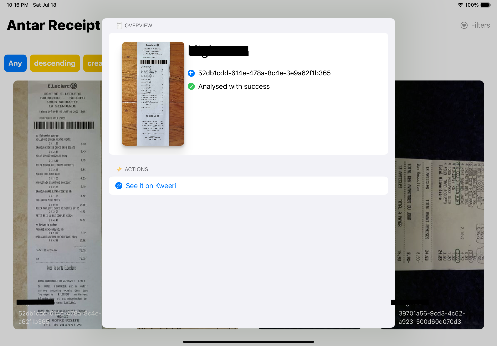
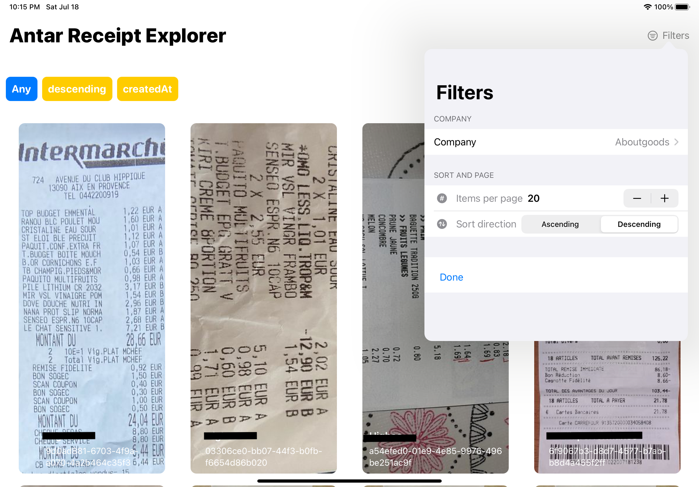
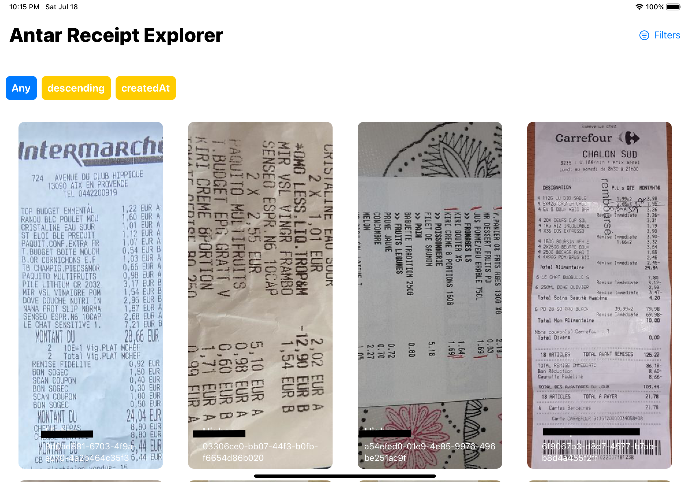

#  Antar Explorer App

## What is it?

An explorer app for the Receipt Analyzer API from Aboutgoods

The app allow to explore the API documented here : https://documentation.agkit.io/receipt-analyzer/v2/api/ 


## Features

- 
  - Detail on a document

- 
  - Filtering options

- 
  - Browsing receipts

## Getting started

This app works on iOS and iPadOS 14 only 

You need to add at the root of the project a file named `Secrets.swift` that contains the following credentials : 

```swift
//  Secrets.swift
//  AntarExplorer


let secretClientId = "{OAuth ClientID}"
let secretClientSecret = "{OAuth Secret}"

let imgProxyUsername = "{imgProxy}"
let imgProxyPassword = "{imgProxyPass}"

//To be able to list companies to access from the interface
public enum Company: String, CaseIterable {

    case {companyName} = "{companyUid}"
    ...
    case any
}

extension Company: Identifiable {
    public var id : Company { self }
}

```

Theses data are furnished by Aboutgoods, you need to have an account before launching the app.

## State

The app is written in SwiftUI. 

### Missing features
- Full Text Search
- Displaying all data from a receipt
- MacOS Compatibility (need Big Sure to implement this)
- Image and Data export to the device 
